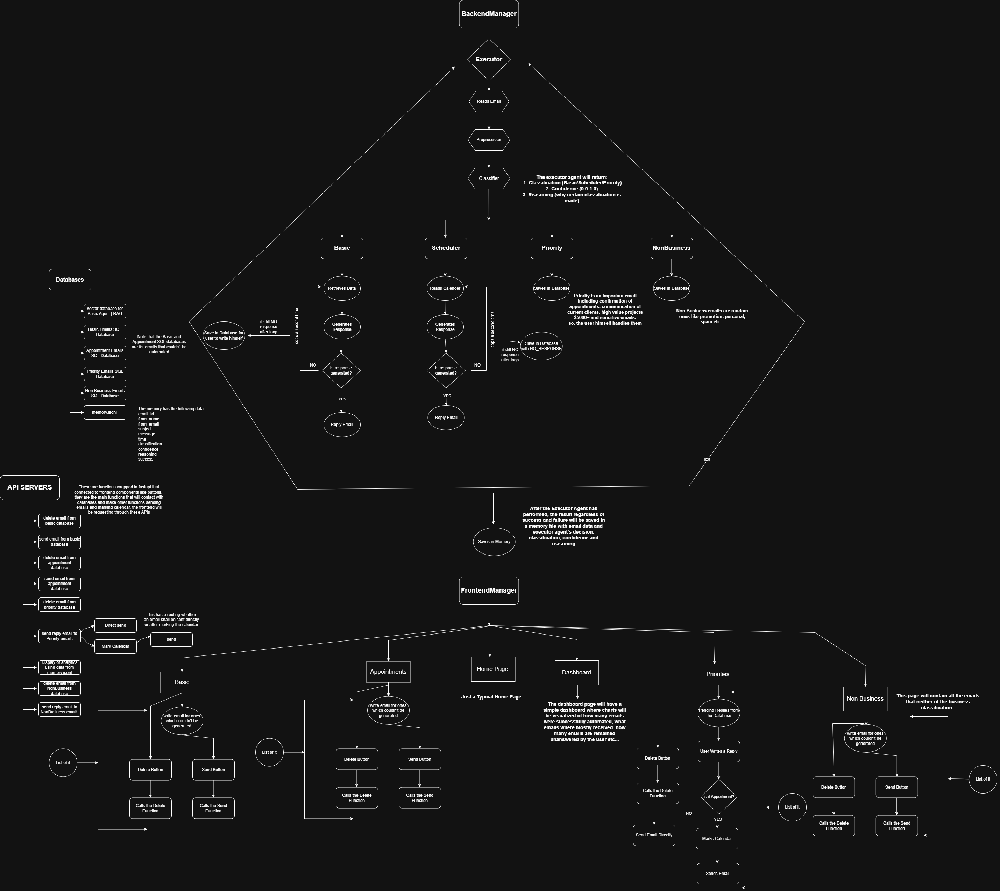

# Inbox Manager

[](https://www.python.org/downloads/)
[](LICENSE)
[](https://fastapi.tiangolo.com/)
[](https://streamlit.io/)
[](https://www.trychroma.com/)

## Demo

Watch the live demo: [Inbox Manager Demo](https://drive.google.com/file/d/1jhVm51-drzOTcm3QLk6DfrgbH1j9kRO6/view?usp=sharing)

An intelligent, AI-powered email inbox management system designed for freelancers, influencers, and professionals who want to manage their emails intelligently. This system automates email categorization, response crafting, and workflow management using advanced Retrieval-Augmented Generation (RAG) and Large Language Models (LLMs).

## Why This Project Exists

In today's fast-paced digital world, professionals receive hundreds of emails daily. Manual email management is time-consuming, error-prone, and often leads to missed opportunities or delayed responses. This project was born from the need to:

- **Automate Routine Tasks**: Free up valuable time by intelligently categorizing and responding to emails
- **Maintain Personal Touch**: Generate context-aware, personalized responses that reflect your unique voice and expertise
- **Scale Professional Communication**: Handle growing email volumes without sacrificing quality
- **Integrate Modern Tools**: Combine the power of AI with low-code automation platforms for seamless workflows

Whether you're an AI engineer, consultant, freelancer, or influencer, Inbox Manager helps you stay organized, responsive, and professional while focusing on what matters most - your core work.

## Features

### Intelligent Email Agents
- **Basic Agent**: Handles general professional correspondence with personalized, context-aware responses
- **Priority Agent**: Manages high-priority emails requiring immediate attention and calendar integration
- **Non-Business Agent**: Processes personal and non-professional communications
- **Scheduler Agent**: Handles appointment scheduling and calendar management

### AI-Powered Response Generation
- **RAG Integration**: Leverages ChromaDB vector database for knowledge retrieval
- **Contextual Responses**: Generates personalized replies based on recipient and email content
- **HTML Email Formatting**: Produces professional, client-ready email responses
- **Multi-Model Support**: Compatible with OpenAI, OpenRouter, and other LLM providers
- **Evaluation Framework**: Includes comprehensive evaluation tools for RAG system performance, ensuring reliable and accurate responses

### Low-Code Integration
- **n8n Integration**: Seamlessly connects with n8n workflows for email sending and calendar management
- **Hybrid Approach**: Combines the precision of custom Python code with the flexibility of low-code automation
- **Workflow Automation**: Automates complex email-to-action pipelines without manual intervention

### User Interfaces
- **Web Dashboard**: Streamlit-based frontend for email management and analytics
- **REST API**: FastAPI-powered backend for programmatic access
- **Real-time Analytics**: Dashboard with email processing statistics and insights

### Data Management
- **Vector Database**: ChromaDB for efficient knowledge base storage and retrieval
- **Persistent Storage**: SQLite databases for email categorization and metadata
- **Memory Management**: JSONL-based memory system for conversation context

## Architecture



### System Overview

The architecture beautifully demonstrates the power of combining **low-code automation** with **pure Python code**:

- **Frontend Layer (Streamlit)**: User-friendly web interface for email management and analytics
- **API Layer (FastAPI)**: RESTful endpoints that orchestrate email processing workflows
- **Backend Agents**: Specialized AI agents for different email types, powered by RAG and LLMs
- **n8n Integration**: Low-code workflows handle email sending and calendar operations, bridging the gap between AI processing and external actions
- **Data Layer**: ChromaDB for vector storage, SQLite for email persistence, and JSONL for memory

### The Beauty of Low-Code + Pure Code

This project showcases the elegance of hybrid development:

**Pure Code Excellence**:
- Custom Python agents with sophisticated AI logic
- Precise control over email categorization and response generation
- Robust error handling through intelligent retry mechanisms and database persistence

**Low-Code Flexibility**:
- n8n workflows for seamless email delivery and calendar integration
- Visual workflow design for complex automation sequences
- Easy integration with external services without custom API development

**Together, they create a powerful synergy**:
- AI precision meets automation scalability
- Custom logic integrates with visual workflows
- Error resilience through database-backed retry loops
- Rapid prototyping combined with production-grade reliability

### Error Handling & Resilience

The system implements sophisticated error handling:
- **Retry Loops**: Failed operations automatically retry with exponential backoff
- **Database Persistence**: All states and intermediate results are saved to prevent data loss
- **Graceful Degradation**: System continues operating even if individual components fail
- **Logging & Monitoring**: Comprehensive logging for debugging and performance tracking

### Project Structure

```
inbox-manager/
├── .env
├── .git/
├── .gitignore
├── .python-version
├── .tmp.driveupload/
├── .venv/
├── API_Server/
│   ├── analytics.py
│   ├── basic_delete.py
│   ├── basic_get_all_emails.py
│   ├── basic_send.py
│   ├── color.py
│   ├── main_server.py
│   ├── nonbusiness_delete.py
│   ├── nonbusiness_get_all_emails.py
│   ├── nonbusiness_send.py
│   ├── priority_delete.py
│   ├── priority_direct_send.py
│   ├── priority_get_all_emails.py
│   ├── priority_mark_calendar.py
│   ├── priority_send.py
│   ├── scheduler_delete.py
│   ├── scheduler_get_all_emails.py
│   ├── scheduler_send.py
│   ├── test.ipynb
│   └── __pycache__/
├── architecture.png
├── Backend/
│   ├── agents/
│   │   ├── basic_agent/
│   │   │   ├── basic_agent.py
│   │   │   ├── evaluation/
│   │   │   │   ├── eval.py
│   │   │   │   ├── test.py
│   │   │   │   ├── tests.jsonl
│   │   │   │   ├── __init__.py
│   │   │   │   └── __pycache__/
│   │   │   ├── knowledge_base/
│   │   │   │   ├── about/
│   │   │   │   │   ├── bio.md
│   │   │   │   │   ├── journey.md
│   │   │   │   │   └── values.md
│   │   │   │   ├── experties/
│   │   │   │   │   ├── agentic_ai.md
│   │   │   │   │   ├── applied_ai.md
│   │   │   │   │   ├── llms.md
│   │   │   │   │   └── rag_systems.md
│   │   │   │   ├── faq/
│   │   │   │   │   └── faq.md
│   │   │   │   ├── offerings/
│   │   │   │   │   ├── collaborations.md
│   │   │   │   │   ├── consulting.md
│   │   │   │   │   └── mentorships.md
│   │   │   │   ├── policies/
│   │   │   │   │   ├── availability.md
│   │   │   │   │   ├── pricing.md
│   │   │   │   │   └── response_rules.md
│   │   │   │   └── __init__.py
│   │   │   ├── rag/
│   │   │   │   ├── answer.py
│   │   │   │   ├── ingest.py
│   │   │   │   ├── __init__.py
│   │   │   │   └── __pycache__/
│   │   │   ├── send_email.py
│   │   │   ├── __init__.py
│   │   │   └── __pycache__/
│   │   ├── nonbusiness_agent/
│   │   │   ├── nonbusiness_agent.py
│   │   │   ├── __init__.py
│   │   │   └── __pycache__/
│   │   ├── priority_agent/
│   │   │   ├── priority_agent.py
│   │   │   ├── __init__.py
│   │   │   └── __pycache__/
│   │   ├── scheduler_agent/
│   │   │   ├── read_calendar.py
│   │   │   ├── scheduler_agent.py
│   │   │   ├── send_email.py
│   │   │   ├── __init__.py
│   │   │   └── __pycache__/
│   │   ├── __init__.py
│   │   └── __pycache__/
│   ├── color.py
│   ├── core/
│   │   ├── basic_agent_database.py
│   │   ├── basic_emails_examples.py
│   │   ├── credentials.json
│   │   ├── nonbusiness_agent_database.py
│   │   ├── nonbusiness_emails_examples.py
│   │   ├── preprocessor.py
│   │   ├── priority_agent_database.py
│   │   ├── priority_emails_examples.py
│   │   ├── receive_email.py
│   │   ├── scheduler_agent_database.py
│   │   ├── scheduler_emails_examples.py
│   │   ├── send_email.py
│   │   ├── token.json
│   │   ├── __init__.py
│   │   └── __pycache__/
│   ├── executor.py
│   ├── __init__.py
│   └── __pycache__/
├── databases/
│   ├── basic_emails.db
│   ├── memory.jsonl
│   ├── nonbusiness_emails.db
│   ├── priority_emails.db
│   ├── scheduler_emails.db
│   └── vector_db/
│       ├── 6837807a-f7b6-4c46-b4bc-755bd52bc50c/
│       └── chroma.sqlite3
├── Frontend/
│   ├── app.py
│   └── pages/
│       ├── appointment.py
│       ├── basic.py
│       ├── dashboard.py
│       ├── home.py
│       ├── nonbusiness.py
│       └── priority.py
├── pyproject.toml
├── README.md
├── uv.lock
└── __pycache__/
```

## Installation

### Prerequisites
- Python 3.12 or higher
- Gmail API credentials (for email access)
- OpenRouter or OpenAI API key

### Setup

1. **Clone the repository**
   ```bash
   git clone https://github.com/yourusername/inbox-manager.git
   cd inbox-manager
   ```

2. **Create virtual environment**
   ```bash
   python -m venv venv
   source venv/bin/activate  # On Windows: venv\Scripts\activate
   ```

3. **Install dependencies**
   ```bash
   pip install -e .
   ```

4. **Configure environment variables**
   Create a `.env` file in the root directory:
   ```env
   OPENROUTER_API_KEY=your_openrouter_api_key
   OPENROUTER_URL=https://openrouter.ai/api/v1
   OPENROUTER_URL="https://openrouter.ai/api/v1"
   DEEPSEEK_MODEL = "tngtech/deepseek-r1t2-chimera:free"
   GEMINI_MODEL = "gemini-2.0-flash"
   GPT_MODEL = "gpt-4.1-mini"
   CLAUDE_MODEL = "anthropic/claude-3-haiku"
   ```

5. **Set up Gmail API**
   - Follow [Google's Gmail API setup guide](https://developers.google.com/gmail/api/quickstart/python)
   - Download `credentials.json` from Google Cloud Console and place it in the `Backend/core/` directory
   - The Gmail client ID and client secret are configured within `credentials.json`
   - Run initial authentication to generate `token.json`

6. **Initialize the knowledge base**
   ```bash
   python -m Backend.agents.basic_agent.rag.ingest
   ```

## Usage

### Starting the Application

1. **Launch the API Server**
   ```bash
   cd API_Server
   python main_server.py
   ```
   The API will be available at `http://localhost:8000`

2. **Launch the Frontend**
   ```bash
   cd Frontend
   streamlit run app.py
   ```
   Access the dashboard at `http://localhost:8501`

### Email Processing Workflow

1. **Email Ingestion**: Connect to Gmail API to fetch incoming emails
2. **Categorization**: AI agents analyze and categorize emails by type
3. **Response Generation**: RAG system retrieves relevant knowledge and crafts responses
4. **Review & Send**: User reviews generated responses before sending
5. **Analytics**: Track response times, categories, and success rates

## API Endpoints

### Basic Emails
- `GET /basic/emails` - Retrieve all basic emails
- `POST /basic/send` - Send response to basic email
- `DELETE /basic/delete/{email_id}` - Delete basic email

### Priority Emails
- `GET /priority/emails` - Retrieve priority emails
- `POST /priority/send` - Send priority response
- `POST /priority/calendar` - Mark calendar event
- `DELETE /priority/delete/{email_id}` - Delete priority email

### Non-Business Emails
- `GET /nonbusiness/emails` - Retrieve non-business emails
- `POST /nonbusiness/send` - Send non-business response
- `DELETE /nonbusiness/delete/{email_id}` - Delete non-business email

### Scheduler Emails
- `GET /scheduler/emails` - Retrieve scheduler emails
- `POST /scheduler/send` - Send scheduler response
- `DELETE /scheduler/delete/{email_id}` - Delete scheduler email

## Configuration

### Knowledge Base Customization
Edit files in `Backend/agents/basic_agent/knowledge_base/`:
- `about/bio.md` - Personal biography
- `experties/*.md` - Areas of expertise
- `policies/*.md` - Response policies and pricing
- `faq/faq.md` - Frequently asked questions

### Agent Configuration
Modify agent parameters in respective agent directories:
- Prompt templates
- Classification thresholds
- Response formatting rules

### Database Configuration
- Vector database: `databases/vector_db/`
- Email databases: `Backend/core/*.db`
- Memory: `databases/memory.jsonl`

## Contributing

1. Fork the repository
2. Create a feature branch (`git checkout -b feature/amazing-feature`)
3. Commit your changes (`git commit -m 'Add amazing feature'`)
4. Push to the branch (`git push origin feature/amazing-feature`)
5. Open a Pull Request

### Development Guidelines
- Follow PEP 8 style guidelines
- Add type hints to new functions
- Write comprehensive docstrings
- Include unit tests for new features
- Update documentation for API changes

## License

This project is licensed under the MIT License - see the [LICENSE](LICENSE) file for details.

## Acknowledgments

- Built with [FastAPI](https://fastapi.tiangolo.com/) for the API backend
- Powered by [Streamlit](https://streamlit.io/) for the web interface
- Knowledge retrieval using [ChromaDB](https://www.trychroma.com/)
- LLM integration via [LiteLLM](https://github.com/BerriAI/litellm)
- Email processing with [Google Gmail API](https://developers.google.com/gmail/api)
- Workflow automation powered by [n8n](https://n8n.io/) for low-code email and calendar integration

## About the Developer

**Ali Sina** ([@AleeCodeAI](https://github.com/AleeCodeAI)) is a 17-year-old developer passionate about Applied AI. He is constantly learning, improving, and building innovative solutions that bridge the gap between cutting-edge AI technology and practical real-world applications. This project represents his commitment to creating tools that enhance productivity and streamline professional workflows through intelligent automation.

## Support

For questions, issues, or contributions:
- Open an issue on GitHub
- Check the documentation in the `docs/` directory
- Review the knowledge base for common questions

## Screenshots

These are screenshots of the application interface and n8n workflows.

### Application Interface


### Agent Interfaces


### Analytics and Settings


The backend operates independently of the frontend. The frontend serves primarily to display analytics and highlight emails requiring manual response—either because the backend could not automate them or because they are deemed important for the user to handle personally. The goal of this project is to better manage emails rather than automate everything. Human-in-the-loop is considered vital for responsible use of AI.

---

**Note**: This system is designed for personal and professional use by freelancers, influencers, consultants, and AI engineers who want to manage their emails intelligently. Ensure compliance with email provider terms of service and privacy regulations when deploying.