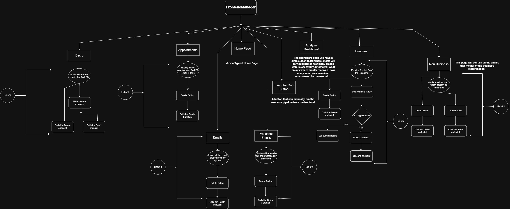

# Inbox Manager — Frontend

Professional React frontend for the Inbox Manager AI email automation and management system.

This application is a Vite + React multi-page app that provides a web UI to review, respond to, schedule, and manage incoming emails that the backend classifies and processes.

Summary of responsibilities:
- Display incoming emails grouped by classification (Basic, Priority, Non-Business).
- Allow manual responses, appointment scheduling, deletion, and manual pipeline execution.
- Show analytics and system-wide metrics on a dashboard.

Contents
- **Overview**: what the frontend provides and how it maps to backend flows
- **Email types & workflows**: behavior and UI affordances for Basic, Priority, and Non-Business emails
- **Pages & UI**: descriptions of each view and actions available
- **API contract & env**: expected endpoints, environment variables, and how the frontend talks to the backend
- **Local setup & development**: commands to run and build
- **Deployment**: recommendations and build notes
- **Troubleshooting** and common tips

Overview
--------

The frontend is the operator-facing interface for Inbox Manager. The backend performs automated classification and automation pipelines; the frontend lets users inspect results and intervene when automation is not possible or when human action is required.

Design goals
- Make email triage fast and predictable.
- Provide obvious controls for scheduling appointments and sending confirmations.
- Be audit-friendly: every displayed email corresponds to a database record that can be deleted or acted upon from the UI.

Email types & workflows
-----------------------

The system classifies incoming emails into three main types. The frontend exposes tabs/pages to manage each type.

- Basic Emails
	- Meaning: Emails that can usually be automated by the system.
	- Flow: Backend attempts automation. If automation succeeds, the email is recorded as processed and updates the database to hold success and metadata and shown on the "Processed" page. If automation fails, the email is saved to the database and surfaced on the `Basic` page for manual handling.
	- UI actions: view content, optionally write and send a manual response, delete the email.
	- The Basic emails, for which Agentic RAG completed but flow failed due to other reasons, will have an AI Draft that displays AI's response. This helps the admin to write manual answer without recalling the notes.

- Priority Emails
	- Meaning: High-sensitivity or high-value emails that must be handled manually (e.g., ongoing client communication, legal, high-value, appointments).
	- Extra metadata: Priority emails include a sub-classification tag (e.g., "CLIENT_COMMUNICATION", "APPOINTMENT", "SENSITIVE", "HIGH_VALUE").
	- Appointment scheduling: On a priority email the operator can pick a calendar date/time for an appointment. When sending the manual response, the frontend triggers the appointment flow: it marks the appointment in the calendar (via the backend) and sends a confirmation email, and then sends the operator's manual response.
	- UI actions: choose appointment date/time, write and send manual response (which also creates and confirms the appointment), delete the email.

- Non-Business Emails
	- Meaning: Spam, promotional, personal messages not relevant to business workflows.
	- Flow: Shown for reference; these can be manually responded to (if desired) or deleted.
	- UI actions: write and send manual response, delete the email.

Shared behavior
- All email tabs provide a `Delete` control to remove the record from the database; deleted items will no longer appear in the frontend.
- Emails that were successfully processed appear in the `Processed` page; these display-only records only support deletion.

Pages & UI
----------

- Home
	- Typical landing page; quick links to the dashboard, email lists, and executor.

- Analysis Dashboard
	- Displays charts and key metrics about the system: total emails received, processed successfully, failed automations, task counts, top senders, and other analytics generated by the backend.

- Emails Page
	- Shows all emails received by the system (filtered). Each item can be inspected and deleted.

- Processed Emails
	- Shows emails that were successfully processed. Read-only with delete option.

- Basic, Priority, Non-Business Tabs
	- Each tab filters and displays emails of the corresponding classification.
	- Priority tab includes sub-class labels and appointment scheduling controls.

- Appointments Page
	- Displays all scheduled appointments (created from Priority email flows).
	- Items are informational; the only action available here is deletion.

- Executor Page
	- A single-page interface with a large action button to manually trigger the background pipeline/polling/execution job.
	- Useful for manual pipeline runs (e.g., re-run ingestion or automation) without waiting for the background worker.

Technology & architecture
-------------------------

- Framework: React (Vite) using JavaScript
- Bundler: Vite
- Styling: (project-specific; check `src/` for CSS files) — the project ships with `src/App.css` and `src/index.css`.
- Pages are located under `src/pages`.
- Single-page app that communicates with the backend API over HTTP (REST) — see API contract below.

Architecture diagram
--------------------

The diagram below (file: `architecture_diagram.png`) illustrates the frontend's high-level pages and the primary flows between them. Key points shown in the diagram:
- The `FrontendManager` routes users to the main functional areas: `Home`, `Analysis Dashboard`, `Emails`, `Processed Emails`, `Appointments`, `Basic`, `Priority`, `Non Business`, and the `Executor` run control.
- Each email tab lists items from the backend; common actions are `Delete` (which calls the delete endpoint) and `Send`/`Respond` (which posts manual responses). Priority emails include an appointment flow that marks the calendar before sending confirmation.
- The `Executor` node allows a manual trigger of the background pipeline; it mirrors the automated background process but is useful for on-demand runs.



API contract (actual endpoints used by the frontend)
-----------------------------------------------

I inspected the frontend source (see `src/config/api.js` and `src/services/emailService.js`) and updated this section to match the concrete endpoints used by the code. Use these routes as the canonical frontend→backend contract unless you want me to sync them differently.

Endpoints referenced by the frontend configuration (`src/config/api.js`):
- `GET /retrieval/basic/manual-pending` — list Basic emails pending manual review
- `POST /actions/basic-action` — send manual response / take action on a Basic email
- `GET /retrieval/priority/unreviewed` — list Priority emails awaiting review
- `POST /actions/priority-action` — take action on a Priority email (payload can include appointment data)
- `GET /retrieval/nonbusiness/unreviewed` — list Non-Business emails awaiting review
- `POST /actions/nonbusiness-action` — take action on a Non-Business email
- `DELETE /delete/email/:gmailId` — delete an email by Gmail ID
- `POST /analysis/get-analysis` — (note: `src/services/emailService.js` attempts to call `apiEndpoints.getAnalysis` which is not defined; the frontend also uses `getDashboardAnalysis` below)
- `POST /analysis/get-dashboard-analysis` or `POST /analysis/get-analysis` — the code uses `getDashboardAnalysis` key (`/analysis/get-analysis`) in `src/config/api.js` and posts to it; keep a single agreed route on the backend for dashboard metrics
- `GET /retrieval/appointments` — list appointments
- `DELETE /delete/appointment` — delete an appointment (endpoint expects payload in DELETE body)
- `GET /retrieval/emails` — list all emails
- `GET /retrieval/email-processing` — list processed emails
- `POST /master-pipeline/executor-run` — run the executor / trigger the master pipeline

Implementation note: I found a small inconsistency in `src/services/emailService.js`:
- `getAnalysisData` calls `apiEndpoints.getAnalysis` (which is not defined in `src/config/api.js`). The code elsewhere calls `getDashboardAnalysis` which maps to `/analysis/get-analysis` in `src/config/api.js`.

Recommendation: either add `getAnalysis` to `src/config/api.js` or update `getAnalysisData` to call `getDashboardAnalysis`. I can make that fix for you if you want.

Environment variables
---------------------

Use Vite environment variables (prefix with `VITE_`). The frontend reads its API base URL from an env var; recommended name:

- `VITE_API_BASE_URL` — e.g. `http://localhost:8000` or production API root

Create a `.env.local` (never commit secrets) with:

```
VITE_API_BASE_URL=http://localhost:8000
```

Note: Vite exposes variables through `import.meta.env` — the app uses `import.meta.env.VITE_API_BASE_URL` to form requests.

Local development
-----------------

Prerequisites
- Node.js 18+ (or LTS)
- npm or yarn

Install dependencies

```
npm install
# or
yarn
```

Run dev server

```
npm run dev
# or
yarn dev
```

Open the app at the address Vite prints (usually `http://localhost:5173`). Ensure `VITE_API_BASE_URL` points to a running backend instance.

Build for production

```
npm run build
# or
yarn build
```

Preview the production build locally

```
npm run preview
# or
yarn preview
```

Developer notes & behavior details
---------------------------------

- Executor: The manual executor button hits an endpoint like `POST /executor/run`. Use with care — typically the pipeline runs automatically in the background.
- Analytics: Charts are driven from summary endpoints; large ranges or heavy queries should be paginated/limited by the backend.

